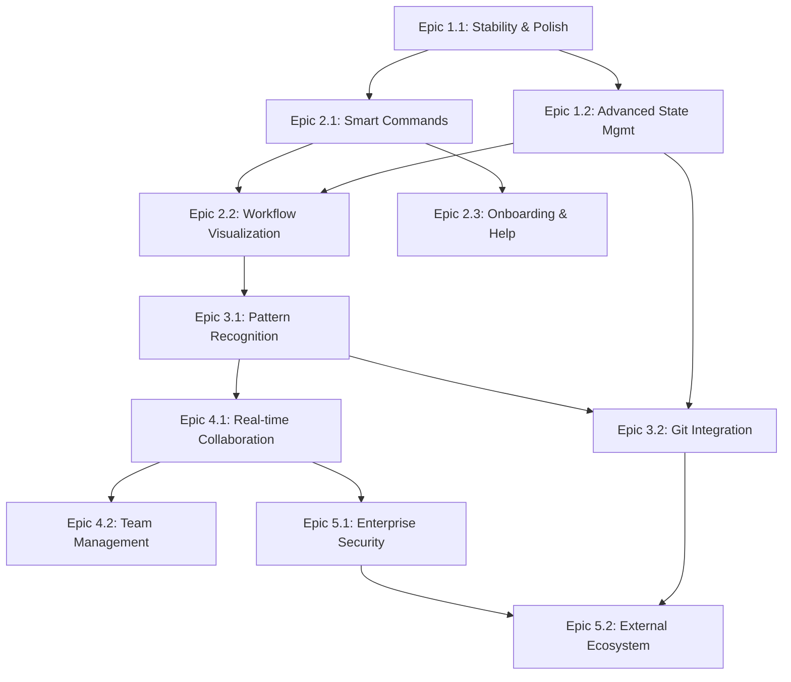

# VSClaude - Epic Planning Document

**Project**: VSClaude - VS Code Extension for Claude Code Workflow  
**Created**: 2025-07-22  
**Status**: Active Planning  
**Next Review**: 2025-08-22  
**Current Version**: v0.1.19 (Working extension with comprehensive workflow management)

## Epic Overview

This document defines the strategic epic roadmap for VSClaude based on the current working system (v0.1.19) and future user value delivery priorities. Each epic represents 2-4 weeks of focused development effort toward specific user outcomes, building upon the existing functional VS Code extension with comprehensive workflow management capabilities.

**Current Status**: Epic 1.1 "Stability and Polish" is in design phase with approved PRD.

---

## Epic 1: 🎯 Production-Ready Foundation

**Priority**: P0 (Critical Path - IN PROGRESS)  
**Estimated Duration**: 6-8 weeks total  
**Target Completion**: Q1 2025  
**Dependencies**: Current working system (v0.1.19)  
**Overall Status**: Active Development

### Epic 1.1: Stability and Polish
**Current Status**: ✅ PRD Approved, 🎨 Design Phase  
**Duration**: 3-4 weeks  
**Owner**: Development Team

#### Vision Statement
Transform the working v0.1.19 extension into a production-ready, enterprise-grade VS Code extension with zero critical bugs, optimal performance, and professional user experience.

#### Key User Stories
- **US-1.1**: Developers want <100ms UI response times for seamless productivity
- **US-1.2**: Teams need reliable operation without crashes during long development sessions  
- **US-1.3**: Users require clear error messages and recovery options when issues occur
- **US-1.4**: Cross-platform consistency across Windows, macOS, and Linux environments

#### Success Metrics
- Extension startup time: <2s (target), <5s (threshold)
- UI response time: <100ms (target), <250ms (threshold)  
- Memory usage: <50MB avg (target), <100MB (threshold)
- Zero critical bugs reported in production for 30+ days
- Test coverage >80% across all components

### Epic 1.2: Advanced State Management
**Current Status**: ⏳ Planned  
**Duration**: 3-4 weeks  
**Dependencies**: Epic 1.1 completion

#### Vision Statement
Implement intelligent, real-time state synchronization that automatically detects document changes, maintains consistency across VS Code sessions, and provides conflict resolution for collaborative workflows.

#### Key User Stories
- **US-1.5**: Automatic tree view updates when project documents change via external tools
- **US-1.6**: State persistence across VS Code restarts and session management
- **US-1.7**: Conflict detection and resolution when multiple users edit the same workflow
- **US-1.8**: Background synchronization with visual status indicators

#### Success Metrics
- Real-time sync accuracy: >99% of changes detected within 500ms
- State consistency: Zero data loss across VS Code sessions
- Conflict resolution: >95% automatic resolution rate
- Background sync efficiency: <5% CPU usage during idle monitoring

---

## Epic 2: ⚡ Intelligent User Experience

**Priority**: P1 (High Impact)  
**Estimated Duration**: 8-10 weeks  
**Target Completion**: Q2 2025  
**Dependencies**: Epic 1 (production foundation)  
**Overall Status**: Planned

### Epic 2.1: Smart Command Interface
**Duration**: 3-4 weeks  
**Dependencies**: Epic 1.1

#### Vision Statement
Create an intelligent command system that learns user patterns, provides contextual suggestions, and automates repetitive workflow operations while maintaining full user control.

#### Key User Stories
- **US-2.1**: Context-aware command suggestions based on current project state and user history
- **US-2.2**: Keyboard-driven workflow with comprehensive shortcuts for all operations
- **US-2.3**: Command palette integration with fuzzy search and recent command history
- **US-2.4**: Smart defaults and auto-completion for workflow setup and configuration

#### Success Metrics
- Command suggestion accuracy: >85% of suggestions accepted by users
- Keyboard workflow adoption: >70% of power users use shortcuts regularly
- Command discovery: >80% of available commands used within 30 days
- Setup efficiency: 50% reduction in new project initialization time

### Epic 2.2: Advanced Workflow Visualization
**Duration**: 3-4 weeks  
**Dependencies**: Epic 1.2, Epic 2.1

#### Vision Statement
Enhance visual workflow representation with interactive diagrams, progress analytics, timeline views, and customizable dashboard layouts that provide comprehensive project insights.

#### Key User Stories
- **US-2.5**: Interactive workflow diagrams showing epic → story → task relationships
- **US-2.6**: Progress analytics with burndown charts, velocity tracking, and completion forecasts
- **US-2.7**: Timeline views for project planning and milestone tracking
- **US-2.8**: Customizable dashboard layouts with drag-and-drop arrangement

#### Success Metrics
- Dashboard customization: >60% of users create custom layouts
- Analytics engagement: >50% of users regularly view progress insights
- Visual navigation efficiency: 40% improvement in workflow element discovery
- User retention: >90% weekly active user retention rate

### Epic 2.3: Onboarding and Help System
**Duration**: 2-3 weeks  
**Dependencies**: Epic 2.1

#### Vision Statement
Implement comprehensive onboarding and contextual help that makes Claude Code methodology accessible to new users while providing advanced guidance for power users.

#### Key User Stories
- **US-2.9**: Interactive guided tutorial for Claude Code methodology introduction
- **US-2.10**: Contextual help panels with tooltips and inline documentation
- **US-2.11**: Best practice suggestions and workflow optimization recommendations
- **US-2.12**: Video tutorials and documentation integration within the extension

#### Success Metrics
- Onboarding completion: >85% of new users complete guided tutorial
- Help system usage: >60% of users access help features within first week
- Methodology adoption: >70% of users follow recommended workflow patterns
- User satisfaction: >4.5/5 rating on onboarding experience

---

## Epic 3: 🤖 Workflow Automation & Intelligence

**Priority**: P1 (High Impact)  
**Estimated Duration**: 8-10 weeks  
**Target Completion**: Q2-Q3 2025  
**Dependencies**: Epic 1, Epic 2  
**Overall Status**: Planned

### Epic 3.1: Pattern Recognition & Templates
**Duration**: 4-5 weeks  
**Dependencies**: Epic 2.1, Epic 2.2

#### Vision Statement
Develop intelligent pattern recognition that identifies successful workflow patterns, creates reusable templates, and provides automation suggestions based on project context and user behavior.

#### Key User Stories
- **US-3.1**: Automatic detection of successful project patterns and template creation
- **US-3.2**: Smart template recommendations based on project type and team context
- **US-3.3**: Workflow pattern library with community sharing capabilities
- **US-3.4**: Intelligent epic and story breakdown suggestions based on historical data

#### Success Metrics
- Pattern recognition accuracy: >80% of suggested patterns adopted
- Template adoption: >60% of new projects use recommended templates
- Community engagement: 50+ shared workflow patterns within 6 months
- Automation efficiency: 40% reduction in manual workflow setup time

### Epic 3.2: Git & Development Tool Integration
**Duration**: 4-5 weeks  
**Dependencies**: Epic 1.2, Epic 3.1

#### Vision Statement
Create seamless integration with Git workflows and development tools that automatically synchronizes workflow state with code changes and provides intelligent development insights.

#### Key User Stories
- **US-3.5**: Automatic workflow state updates based on Git commits and branch changes
- **US-3.6**: Integration with pull requests to track story completion and epic progress
- **US-3.7**: Development metrics integration (code coverage, build status, deployment state)
- **US-3.8**: Intelligent task creation from code reviews and issue tracking

#### Success Metrics
- Git sync accuracy: >95% of workflow states correctly synchronized
- Development integration: >70% of teams use automated development metrics
- Pull request workflow adoption: >80% of stories linked to PR workflows
- Automation reliability: >99% uptime for automated integrations

---

## Epic 4: 👥 Team Collaboration & Sharing

**Priority**: P2 (Strategic Enhancement)  
**Estimated Duration**: 6-8 weeks  
**Target Completion**: Q3 2025  
**Dependencies**: Epic 1, Epic 3  
**Overall Status**: Planned

### Epic 4.1: Real-time Collaboration
**Duration**: 4-5 weeks  
**Dependencies**: Epic 1.2, Epic 3.1

#### Vision Statement
Enable real-time collaborative workflow management where team members can simultaneously work on shared projects with live updates, conflict resolution, and coordinated development activities.

#### Key User Stories
- **US-4.1**: Real-time workflow document sharing with live cursor and edit presence
- **US-4.2**: Collaborative epic planning sessions with simultaneous editing capabilities
- **US-4.3**: Team member activity feeds showing workflow progress and contributions
- **US-4.4**: Conflict resolution system for overlapping workflow modifications

#### Success Metrics
- Collaboration adoption: >70% of teams use real-time sharing features
- Conflict resolution efficiency: >90% of conflicts automatically resolved
- Team coordination improvement: 30% reduction in workflow coordination overhead
- User satisfaction: >4.2/5 rating on collaboration features

### Epic 4.2: Team Management & Analytics
**Duration**: 2-3 weeks  
**Dependencies**: Epic 4.1

#### Vision Statement
Provide comprehensive team management capabilities with role-based permissions, team analytics, and productivity insights that help leaders optimize team performance and workflow efficiency.

#### Key User Stories
- **US-4.5**: Team workspace creation with role-based access control and permissions
- **US-4.6**: Team productivity analytics with velocity tracking and capacity planning
- **US-4.7**: Portfolio-level visibility across multiple projects and team members
- **US-4.8**: Automated team reporting and stakeholder communication tools

#### Success Metrics
- Team workspace adoption: >50% of organizations create team workspaces
- Analytics engagement: >80% of team leads regularly review team metrics
- Portfolio management: 100% visibility into active team projects
- Reporting automation: 60% reduction in manual reporting overhead

---

## Epic 5: 🔗 Enterprise Integration & Extensibility

**Priority**: P2 (Strategic Enhancement)  
**Estimated Duration**: 6-8 weeks  
**Target Completion**: Q3-Q4 2025  
**Dependencies**: Epic 1, Epic 4  
**Overall Status**: Planned

### Epic 5.1: Enterprise Security & Compliance
**Duration**: 3-4 weeks  
**Dependencies**: Epic 4.1

#### Vision Statement
Implement enterprise-grade security features including SSO integration, audit logging, compliance reporting, and data governance that meet organizational security requirements.

#### Key User Stories
- **US-5.1**: Single Sign-On (SSO) integration with popular enterprise identity providers
- **US-5.2**: Comprehensive audit logging for all workflow actions and data changes
- **US-5.3**: Data encryption at rest and in transit for sensitive workflow information
- **US-5.4**: Compliance reporting for SOC 2, GDPR, and other regulatory frameworks

#### Success Metrics
- Enterprise adoption: 20+ enterprise organizations using security features
- Compliance certification: SOC 2 Type II certification achieved
- Security incidents: Zero security breaches or data leakage events
- Audit completeness: 100% of workflow actions captured in audit logs

### Epic 5.2: External Tool Ecosystem
**Duration**: 3-4 weeks  
**Dependencies**: Epic 3.2, Epic 5.1

#### Vision Statement
Create a comprehensive integration ecosystem connecting VSClaude with project management tools, CI/CD pipelines, and development platforms to establish it as the central workflow hub.

#### Key User Stories
- **US-5.5**: Integration marketplace with popular tools (Jira, Linear, Asana, Trello)
- **US-5.6**: CI/CD pipeline integration for automated workflow state updates
- **US-5.7**: Webhook framework for custom integrations and third-party extensions
- **US-5.8**: API platform for developers to create custom workflow extensions

#### Success Metrics
- Integration adoption: >50% of teams use 2+ external integrations
- Marketplace growth: 50+ available integrations within 12 months
- Developer ecosystem: 100+ community-contributed extensions
- API usage: 1000+ API calls per day across active integrations

---

## Epic Dependencies and Critical Path

## Risk Assessment and Mitigation Strategies

### High Risk Items
- **Epic 3.1 Pattern Recognition**: AI/ML complexity and accuracy challenges
  - *Mitigation*: Start with rule-based patterns, gradually introduce ML components
  - *Fallback*: Manual template creation with guided workflows

- **Epic 4.1 Real-time Collaboration**: Technical complexity and conflict resolution
  - *Mitigation*: Use proven collaboration libraries (Yjs, ShareJS)
  - *Fallback*: Asynchronous collaboration with manual merge resolution

### Medium Risk Items
- **Epic 2.2 Workflow Visualization**: Performance with large datasets
  - *Mitigation*: Implement virtualization and progressive loading
  - *Fallback*: Simplified views for large projects

- **Epic 5.1 Enterprise Security**: Compliance complexity and certification costs
  - *Mitigation*: Partner with security consultants and automated compliance tools
  - *Fallback*: Basic security features without full certification

### Low Risk Items
- **Epic 2.3 Onboarding**: Content creation and maintenance overhead
  - *Mitigation*: Crowdsource content creation and automated updating
  - *Fallback*: Static documentation with periodic manual updates

## Success Metrics Dashboard

| Epic | Primary KPI | Target | Current Status |
|------|-------------|---------|----------------|
| Epic 1.1 | Bug Rate | 0 critical bugs | 🎨 Design Phase |
| Epic 1.2 | Sync Accuracy | >99% real-time | ⏳ Planned |
| Epic 2.1 | Command Efficiency | 50% time reduction | ⏳ Planned |
| Epic 2.2 | User Engagement | >60% dashboard use | ⏳ Planned |
| Epic 2.3 | Onboarding Success | >85% completion | ⏳ Planned |
| Epic 3.1 | Pattern Adoption | >80% accuracy | ⏳ Planned |
| Epic 3.2 | Integration Reliability | >99% uptime | ⏳ Planned |
| Epic 4.1 | Collaboration Usage | >70% team adoption | ⏳ Planned |
| Epic 4.2 | Analytics Engagement | >80% lead usage | ⏳ Planned |
| Epic 5.1 | Enterprise Adoption | 20+ organizations | ⏳ Planned |
| Epic 5.2 | Ecosystem Growth | 50+ integrations | ⏳ Planned |

## Resource Allocation and Timeline

### Q1 2025 (Current Quarter)
- **Epic 1.1**: Stability & Polish (In Progress - Design Phase)
- **Epic 1.2**: Advanced State Management (Planning Phase)

### Q2 2025  
- **Epic 2.1**: Smart Command Interface
- **Epic 2.2**: Advanced Workflow Visualization  
- **Epic 2.3**: Onboarding & Help System
- **Epic 3.1**: Pattern Recognition & Templates

### Q3 2025
- **Epic 3.2**: Git & Development Tool Integration
- **Epic 4.1**: Real-time Collaboration
- **Epic 4.2**: Team Management & Analytics

### Q4 2025
- **Epic 5.1**: Enterprise Security & Compliance
- **Epic 5.2**: External Tool Ecosystem

---

## Next Actions

### Immediate (This Week)
1. **Complete Epic 1.1 Design Phase**: Execute `/project:agile:design` to finalize architecture
2. **Begin Epic 1.1 Implementation Planning**: Create detailed task breakdown
3. **Stakeholder Review**: Present epic roadmap for feedback and approval

### Short Term (Next 2 Weeks)  
1. **Epic 1.1 Development**: Begin implementation of stability and polish features
2. **Epic 1.2 Planning**: Start architectural design for advanced state management
3. **Resource Planning**: Identify development resources for Q2 2025 epics

### Long Term (Next Month)
1. **Epic 2 Preparation**: Begin UX research and design for smart command interface
2. **Community Engagement**: Start building user feedback channels for feature validation
3. **Technology Evaluation**: Research collaboration and pattern recognition technologies

---

*This epic roadmap represents a strategic, value-driven approach to evolving VSClaude from a functional workflow manager into a comprehensive, intelligent development platform that serves individual developers, teams, and enterprise organizations.*