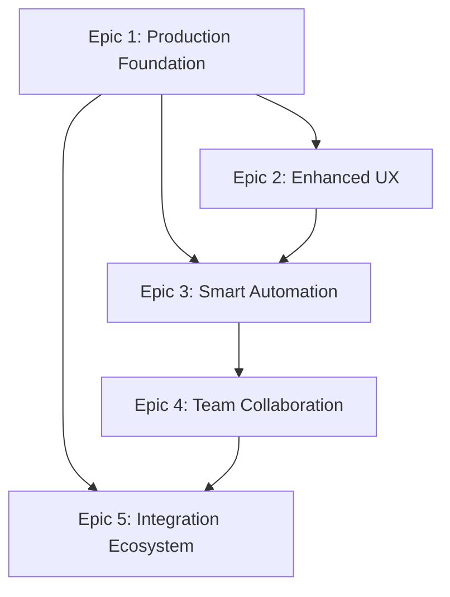

# VSClaude - Epic Planning Document

**Project**: VSClaude - VS Code Extension for Claude Code Workflow  
**Created**: 2025-07-22  
**Status**: Active Planning  
**Next Review**: 2025-08-22  

## Epic Overview

This document defines the strategic epic breakdown for VSClaude based on the current working system (v0.1.14) and user value delivery priorities. Each epic represents 2-4 weeks of focused development effort toward specific user outcomes, building upon the existing functional VS Code extension with comprehensive workflow management capabilities.

---

## Epic 1: 🎯 Production-Ready Foundation

**Priority**: P0 (Critical Path)  
**Estimated Duration**: 3 weeks  
**Target Completion**: Q1 2025  
**Dependencies**: Current working system (v0.1.14)
**Current Status**: Active (Epic 1.1 - Stability and Polish in design phase)

### Vision Statement
Transform the working v0.1.14 extension into a production-ready, enterprise-grade VS Code extension with zero critical bugs, optimal performance, and professional user experience.

### User Stories

#### As a developer using VSClaude daily...
- **US-1.1**: I want the extension to load and respond quickly (<2s startup, <100ms interactions) so my productivity isn't impacted
- **US-1.2**: I want reliable operation without crashes or memory leaks during 8+ hour development sessions  
- **US-1.3**: I want helpful error messages and recovery options when issues occur
- **US-1.4**: I want consistent behavior across Windows, macOS, and Linux environments

#### As a team lead evaluating developer tools...
- **US-1.5**: I want confidence in tool stability before recommending to my team
- **US-1.6**: I want clear documentation and support resources for troubleshooting

### Acceptance Criteria
- [ ] Extension startup time <2 seconds on typical VS Code launch
- [ ] UI interactions respond within 100ms consistently  
- [ ] Zero memory leaks during extended usage sessions
- [ ] Memory usage stays under 50MB average
- [ ] Zero critical bugs reported in production for 30+ days
- [ ] Test coverage >80% across all components
- [ ] 100% feature parity across all supported platforms
- [ ] Professional error handling with user-friendly messages

### Technical Deliverables
- Comprehensive error handling and graceful degradation
- Performance optimization for webview and tree rendering  
- Memory leak detection and resolution
- Cross-platform compatibility testing and fixes
- Enhanced logging and diagnostic capabilities
- Professional UI/UX polish and consistency

### Success Metrics
- Extension startup time: <2s (target), <5s (threshold)
- UI response time: <100ms (target), <250ms (threshold)  
- Memory usage: <50MB avg (target), <100MB (threshold)
- Crash rate: 0% (target), <0.1% (threshold)
- User satisfaction: >4.5/5 rating target

---

## Epic 2: ⚡ Enhanced User Experience  

**Priority**: P1 (High Impact)  
**Estimated Duration**: 3 weeks  
**Target Completion**: Q1 2025  
**Dependencies**: Epic 1 (production foundation)

### Vision Statement
Elevate user productivity through intuitive interactions, keyboard-driven workflows, smart defaults, and contextual assistance that makes Claude Code methodology accessible to both new and expert users.

### User Stories

#### As a power user who prefers keyboard navigation...
- **US-2.1**: I want comprehensive keyboard shortcuts for all common actions so I can work without mouse interaction
- **US-2.2**: I want customizable keybindings that integrate with my existing VS Code setup
- **US-2.3**: I want quick navigation between projects, epics, and stories using keyboard commands

#### As a developer new to Claude Code methodology...  
- **US-2.4**: I want guided onboarding that teaches me the workflow through interactive tutorials
- **US-2.5**: I want contextual help and tooltips that explain each step of the process
- **US-2.6**: I want smart defaults and suggestions that guide me toward best practices

#### As an experienced developer managing complex projects...
- **US-2.7**: I want advanced filtering and search capabilities to find specific workflow elements quickly
- **US-2.8**: I want bulk operations to manage multiple items efficiently
- **US-2.9**: I want customizable dashboard layouts that match my workflow preferences

### Acceptance Criteria
- [ ] Complete keyboard shortcut coverage for 90% of common actions
- [ ] Interactive onboarding tutorial with 5+ guided steps
- [ ] Contextual help system with tooltips and inline documentation
- [ ] Advanced search and filtering across all workflow elements
- [ ] Bulk operations for common multi-item tasks
- [ ] Customizable dashboard with saved layout preferences
- [ ] Smart defaults that reduce setup time by 50%

### Technical Deliverables
- Comprehensive keyboard shortcut system with customizable bindings
- Interactive tutorial system with step-by-step guidance
- Advanced search and filtering engine
- Bulk operation framework for multi-item management
- Customizable dashboard with layout persistence  
- Context-sensitive help and tooltip system

### Success Metrics
- Keyboard workflow adoption: >60% of users use shortcuts regularly
- Onboarding completion rate: >80% complete tutorial
- User efficiency: 40% reduction in time-to-complete common tasks
- Feature discovery: >70% of features used within 30 days

---

## Epic 3: 🤖 Smart Workflow Automation

**Priority**: P1 (High Impact)  
**Estimated Duration**: 4 weeks  
**Target Completion**: Q2 2025  
**Dependencies**: Epic 1 (foundation), Epic 2 (enhanced UX)

### Vision Statement
Implement intelligent automation that learns from user patterns, provides proactive suggestions, and reduces manual overhead while maintaining full user control over the development workflow.

### User Stories

#### As a developer working on multiple similar projects...
- **US-3.1**: I want the extension to suggest relevant actions based on my current context and project state
- **US-3.2**: I want pattern recognition that identifies common workflow sequences and offers automation
- **US-3.3**: I want template creation from successful project patterns for reuse

#### As a team member following established practices...
- **US-3.4**: I want automatic validation that ensures I'm following team workflow standards
- **US-3.5**: I want progress tracking that identifies blockers and suggests next steps
- **US-3.6**: I want integration with Git that automatically updates workflow state based on commits

### Acceptance Criteria
- [ ] Context-aware suggestions appear within 200ms of state changes
- [ ] Pattern recognition identifies and automates 70% of repetitive tasks
- [ ] Template system saves 60% of setup time for new projects
- [ ] Workflow validation prevents 90% of common process violations
- [ ] Git integration automatically syncs workflow state with code changes
- [ ] Progress analytics provide actionable insights for productivity improvement

### Technical Deliverables  
- Smart suggestion engine with context analysis
- Pattern recognition system for workflow automation
- Template creation and management system
- Workflow validation framework with rule engine
- Git integration for automatic state synchronization
- Analytics dashboard with productivity insights

### Success Metrics
- Suggestion accuracy: >85% of suggestions accepted by users
- Automation adoption: >70% of repetitive tasks automated  
- Template usage: >50% of new projects use templates
- Process compliance: >90% adherence to workflow standards
- Productivity gain: 35% reduction in manual workflow overhead

---

## Epic 4: 👥 Team Collaboration Platform

**Priority**: P2 (Strategic Enhancement)  
**Estimated Duration**: 4 weeks  
**Target Completion**: Q2 2025  
**Dependencies**: Epic 1, Epic 3 (automation foundation)

### Vision Statement
Transform VSClaude from a single-developer tool into a collaborative platform that enables teams to share workflows, coordinate development, and maintain consistent practices across all team members.

### User Stories

#### As a tech lead standardizing team practices...
- **US-4.1**: I want to create and distribute team workflow templates so everyone follows consistent practices
- **US-4.2**: I want team-wide analytics and progress visibility for project management
- **US-4.3**: I want to enforce coding standards and workflow compliance across the team

#### As a team member collaborating on shared projects...
- **US-4.4**: I want to see real-time updates when other team members modify workflow documents
- **US-4.5**: I want to share my successful patterns and learn from others' approaches
- **US-4.6**: I want conflict resolution when multiple developers work on the same workflow elements

#### As a project manager overseeing development teams...
- **US-4.7**: I want portfolio-level visibility into all team projects and their health status
- **US-4.8**: I want resource allocation insights and capacity planning tools
- **US-4.9**: I want automated reporting for stakeholder communication

### Acceptance Criteria
- [ ] Team template sharing with central repository management
- [ ] Real-time collaboration with conflict resolution
- [ ] Team analytics dashboard with project health indicators
- [ ] Workflow compliance monitoring and enforcement
- [ ] Portfolio management for 10+ concurrent projects
- [ ] Automated report generation for stakeholder updates

### Technical Deliverables
- Team configuration and member management system
- Real-time collaboration engine with conflict resolution
- Centralized template repository with version control
- Team analytics and reporting dashboard
- Portfolio management interface with health metrics
- Automated compliance monitoring and enforcement

### Success Metrics  
- Team adoption: >80% of team members use shared templates
- Collaboration efficiency: 50% reduction in coordination overhead
- Compliance rate: >95% adherence to team standards
- Management visibility: 100% of projects trackable in portfolio view
- Stakeholder satisfaction: >4.5/5 rating on automated reports

---

## Epic 5: 🔗 Advanced Integration Ecosystem

**Priority**: P2 (Strategic Enhancement)  
**Estimated Duration**: 3 weeks  
**Target Completion**: Q3 2025  
**Dependencies**: Epic 1, Epic 4 (collaboration platform)

### Vision Statement
Create a comprehensive integration ecosystem that connects VSClaude with external tools, CI/CD pipelines, and development workflows, making it the central hub for Claude Code methodology across the entire development lifecycle.

### User Stories

#### As a DevOps engineer managing CI/CD pipelines...
- **US-5.1**: I want GitHub Actions integration that automatically updates workflow state based on deployment status
- **US-5.2**: I want webhook support to trigger workflow updates from external systems
- **US-5.3**: I want integration with project management tools (Jira, Linear, etc.) for seamless issue tracking

#### As a developer using multiple tools in my workflow...
- **US-5.4**: I want Slack/Teams integration for workflow notifications and team updates  
- **US-5.5**: I want calendar integration to plan and schedule epic and story work
- **US-5.6**: I want documentation system integration (Notion, Confluence) for requirements syncing

#### As an enterprise user with security requirements...
- **US-5.7**: I want SSO integration with corporate identity providers
- **US-5.8**: I want audit logging for all workflow changes and actions
- **US-5.9**: I want enterprise-grade security and compliance features

### Acceptance Criteria
- [ ] GitHub Actions workflows automatically sync with project state
- [ ] Webhook system handles 100+ integrations reliably
- [ ] Popular project management tools integrate seamlessly  
- [ ] Team communication platforms provide real-time notifications
- [ ] Enterprise security features meet SOC 2 compliance requirements
- [ ] Audit logging captures 100% of workflow changes

### Technical Deliverables
- GitHub Actions integration with workflow state synchronization
- Webhook framework for external system integrations
- Project management tool connectors (Jira, Linear, Asana)
- Team communication platform integrations (Slack, Teams)
- Enterprise security framework with SSO and audit logging
- Documentation system integrations for requirements management

### Success Metrics
- Integration adoption: >60% of teams use 2+ external integrations
- Automation reliability: >99.5% uptime for webhook processing
- Enterprise adoption: 10+ enterprise customers using security features
- Ecosystem growth: 20+ community-contributed integrations
- User productivity: 25% reduction in context switching between tools

---

## Epic Dependencies and Sequencing

## Risk Assessment and Mitigation

### Epic 1 Risks
- **Medium**: Performance bottlenecks on large projects → Implement lazy loading and virtualization
- **Low**: Cross-platform compatibility issues → Comprehensive automated testing across platforms

### Epic 2 Risks  
- **Medium**: Feature complexity overwhelming new users → Gradual feature introduction with progressive disclosure
- **Low**: Keyboard shortcut conflicts with VS Code → Intelligent conflict detection and resolution

### Epic 3 Risks
- **High**: AI suggestions accuracy and user trust → Extensive user testing and feedback loops
- **Medium**: Pattern recognition false positives → Conservative automation with user confirmation

### Epic 4 Risks
- **High**: Real-time collaboration complexity → Proven collaboration libraries and conflict resolution patterns  
- **Medium**: Team adoption resistance → Change management and gradual rollout strategies

### Epic 5 Risks
- **Medium**: External API reliability and rate limiting → Robust error handling and caching strategies
- **Medium**: Security compliance complexity → Partner with security experts and automated compliance tools

## Success Metrics Summary

| Epic | Primary KPI | Target | Threshold |
|------|------------|---------|-----------|
| Epic 1 | System Reliability | 0% critical bugs | <0.1% bugs |
| Epic 2 | User Efficiency | 40% time reduction | 25% reduction |
| Epic 3 | Automation Adoption | >70% tasks automated | >50% automated |
| Epic 4 | Team Collaboration | >80% template usage | >60% usage |
| Epic 5 | Integration Usage | >60% use 2+ integrations | >40% usage |

---

*This epic plan represents a strategic roadmap that builds upon the existing working VSClaude system (v0.1.14) to deliver continuous user value while expanding capabilities for individual developers, teams, and enterprises.*