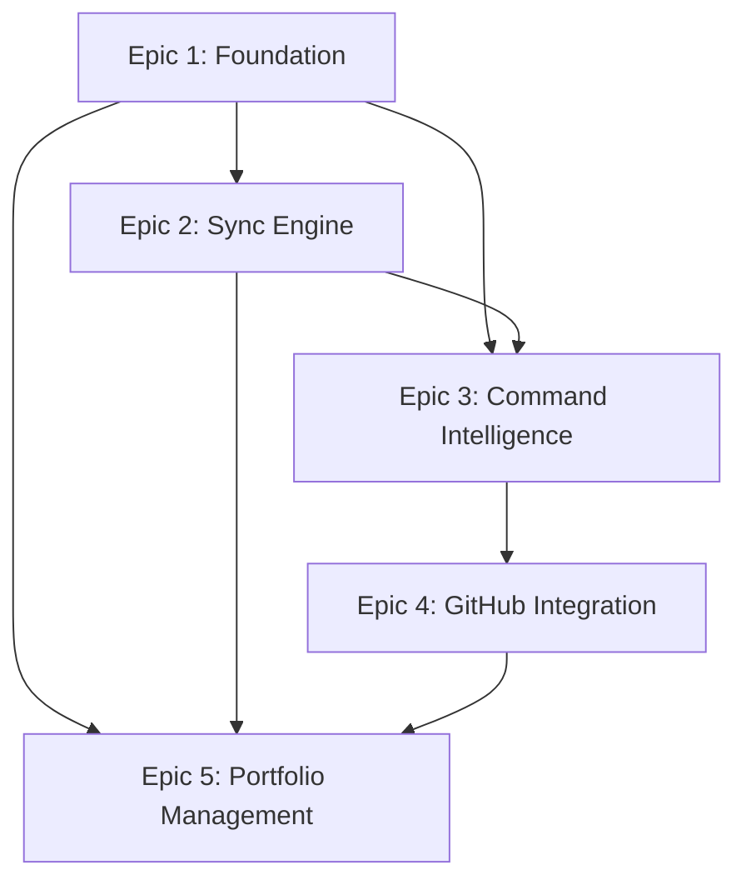

# VSClaude - Epic Planning Document

**Project**: VSClaude - VS Code Extension for Claude Code Workflow  
**Created**: 2025-07-22  
**Status**: Active Planning  
**Next Review**: 2025-08-22  

## Epic Overview

This document defines the strategic epic breakdown for VSClaude based on user value delivery, technical dependencies, and risk mitigation. Each epic represents 2-4 weeks of focused development effort toward specific user outcomes.

---

## Epic 1: 🚀 Core User Experience Foundation

**Priority**: P0 (Critical Path)  
**Estimated Duration**: 3-4 weeks  
**Target Completion**: Q1 2025  
**Dependencies**: None (foundational epic)

### Vision Statement
Deliver a stable, performant VS Code extension that provides intuitive visual workflow management for Claude Code users with zero critical bugs.

### User Stories

#### As a developer using Claude Code...
- **US-1.1**: I want to see my project structure visualized in a tree view so I can quickly understand my current workflow state
- **US-1.2**: I want the extension to load quickly (<2s) and respond to interactions immediately (<100ms) so my productivity isn't impacted  
- **US-1.3**: I want reliable error handling so the extension doesn't crash and provides helpful feedback when issues occur
- **US-1.4**: I want cross-platform compatibility so I can use the same workflow on Windows, macOS, and Linux

#### As a project manager...
- **US-1.5**: I want to quickly assess project health and progress without diving into technical details

### Acceptance Criteria
- [ ] Extension loads in <2 seconds on typical VS Code startup
- [ ] UI interactions respond within 100ms
- [ ] Zero memory leaks during 8+ hour usage sessions
- [ ] Memory usage stays under 50MB average
- [ ] Extension rating >4.0/5.0 when published  
- [ ] Test coverage >80%
- [ ] 100% feature parity across Windows, macOS, Linux
- [ ] Zero critical bugs in production for 30+ days

### Technical Deliverables
- Enhanced error handling and graceful degradation
- Performance optimization for tree view rendering
- Memory leak detection and resolution
- Cross-platform compatibility testing
- UI/UX polish and consistency improvements

### Success Metrics
- Extension startup time: <2s (target), <5s (threshold)
- UI response time: <100ms (target), <250ms (threshold)
- Memory usage: <50MB avg (target), <100MB (threshold)
- Crash rate: 0% (target), <0.1% (threshold)

---

## Epic 2: 🔄 Real-time Synchronization Engine

**Priority**: P1 (High Impact)  
**Estimated Duration**: 3 weeks  
**Target Completion**: Q1 2025  
**Dependencies**: Epic 1 (foundation stability)

### Vision Statement
Eliminate manual refresh workflows by providing automatic, real-time synchronization between file system changes and the VS Code tree view.

### User Stories

#### As a developer actively working on a project...
- **US-2.1**: I want the tree view to automatically update when I modify project documents so I always see current state
- **US-2.2**: I want Git status changes to be reflected immediately in the tree view so I understand what needs attention
- **US-2.3**: I want background sync indicators so I know when the extension is processing changes
- **US-2.4**: I want conflict resolution when multiple changes happen simultaneously

#### As a team member collaborating...
- **US-2.5**: I want to see updates when team members push changes that affect the project structure

### Acceptance Criteria
- [ ] File system changes reflected within 500ms
- [ ] Git status changes detected and displayed automatically
- [ ] Background sync operates without UI blocking
- [ ] Handles concurrent file modifications gracefully
- [ ] Sync status indicators provide clear feedback
- [ ] Works with large repositories (1000+ files) efficiently

### Technical Deliverables
- File system watcher implementation using VS Code API
- Git status integration for change detection  
- Debounced update mechanism to prevent thrashing
- Background processing with progress indicators
- Conflict detection and resolution strategies

### Success Metrics
- Update latency: <500ms (target), <1s (threshold)
- Large repo performance: <2s refresh for 1000+ files
- Resource usage during sync: <10MB additional memory
- Sync accuracy: 100% file changes detected

---

## Epic 3: 🎯 Intelligent Command Integration

**Priority**: P1 (High Impact)  
**Estimated Duration**: 4 weeks  
**Target Completion**: Q2 2025  
**Dependencies**: Epic 1 (foundation), Epic 2 (state sync)

### Vision Statement
Transform command execution from manual CLI operations to context-aware, intelligent suggestions that guide users through optimal workflows.

### User Stories

#### As a developer learning Claude Code methodology...
- **US-3.1**: I want smart command suggestions based on my current project state so I know what to do next
- **US-3.2**: I want command validation to prevent mistakes before execution
- **US-3.3**: I want command history and favorites so I can quickly repeat common operations

#### As an experienced Claude Code user...
- **US-3.4**: I want batch operations to execute multiple related commands efficiently
- **US-3.5**: I want keyboard shortcuts for frequently used commands
- **US-3.6**: I want auto-completion for command parameters

### Acceptance Criteria
- [ ] Context-aware suggestions appear within 200ms of state changes
- [ ] Command validation prevents 90% of common user errors
- [ ] Batch operations complete 50% faster than individual commands
- [ ] Keyboard shortcuts work consistently across all VS Code platforms
- [ ] Auto-completion provides accurate suggestions >95% of the time
- [ ] Command history persists across VS Code sessions

### Technical Deliverables
- Smart suggestion engine based on project state analysis
- Command validation framework with error prevention
- Batch operation queue and execution system
- Keyboard shortcut registration and management
- Parameter auto-completion with intelligent defaults
- Persistent command history storage

### Success Metrics
- Suggestion accuracy: >90% relevant suggestions
- Error prevention: >90% reduction in invalid command execution
- User efficiency: 40% reduction in command execution time
- Feature adoption: >70% users using smart suggestions within 30 days

---

## Epic 4: 🔗 GitHub Ecosystem Integration

**Priority**: P2 (Strategic Enhancement)  
**Estimated Duration**: 3-4 weeks  
**Target Completion**: Q2 2025  
**Dependencies**: Epic 1, Epic 3 (command intelligence)

### Vision Statement
Seamlessly connect Claude Code workflows with GitHub ecosystem for configuration management, template sharing, and collaborative development.

### User Stories

#### As a team lead standardizing development practices...
- **US-4.1**: I want to store team workflow templates in GitHub so everyone uses consistent practices
- **US-4.2**: I want to enforce project structure standards through automated scaffolding
- **US-4.3**: I want to track team velocity and provide analytics for process improvement

#### As a developer starting new projects...
- **US-4.4**: I want to quickly scaffold new projects using proven templates
- **US-4.5**: I want to share successful workflow patterns with the community
- **US-4.6**: I want integration with Issues and PRs for seamless project management

### Acceptance Criteria
- [ ] Template repositories can be cloned and applied in <30 seconds
- [ ] Configuration sync works reliably across team members
- [ ] Project scaffolding creates valid Claude Code structure 100% of the time
- [ ] GitHub Issue integration creates proper workflow documents
- [ ] Analytics provide actionable insights for team improvement
- [ ] Template sharing works through public/private repositories

### Technical Deliverables
- GitHub repository integration for configuration management
- Template system with scaffolding automation
- Issue and PR integration for workflow initiation
- Team analytics and velocity tracking
- Configuration synchronization across team members
- Community template marketplace foundation

### Success Metrics
- Template adoption: >50% of new projects use templates
- Team velocity: 25% improvement in sprint completion
- Configuration sync: 100% reliability across team members
- Community engagement: 10+ community templates created

---

## Epic 5: 📊 Multi-Project Portfolio Management

**Priority**: P2 (Strategic Enhancement)  
**Estimated Duration**: 4 weeks  
**Target Completion**: Q3 2025  
**Dependencies**: Epic 1, Epic 2, Epic 4 (GitHub integration)

### Vision Statement
Enable developers and teams to manage multiple Claude Code projects simultaneously with portfolio-level insights and resource allocation.

### User Stories

#### As a developer working on multiple projects...
- **US-5.1**: I want to switch between projects quickly without losing context
- **US-5.2**: I want to see portfolio-level progress and health metrics
- **US-5.3**: I want to manage cross-project dependencies and resource allocation

#### As a technical lead overseeing multiple teams...
- **US-5.4**: I want portfolio-level reporting for stakeholder communication
- **US-5.5**: I want resource allocation insights to optimize team productivity
- **US-5.6**: I want risk assessment across the project portfolio

### Acceptance Criteria
- [ ] Project switching completes in <1 second with full context preservation
- [ ] Portfolio dashboard loads within 2 seconds for 10+ active projects
- [ ] Cross-project dependency tracking is 100% accurate
- [ ] Resource allocation analytics provide actionable insights
- [ ] Portfolio health metrics update in real-time
- [ ] Export capabilities work for all common formats (PDF, CSV, JSON)

### Technical Deliverables
- Multi-project workspace management system
- Portfolio dashboard with health metrics
- Cross-project dependency mapping
- Resource allocation tracking and optimization
- Portfolio-level reporting and analytics
- Export system for stakeholder communication

### Success Metrics
- Context switching time: <1s (target), <3s (threshold)
- Portfolio load time: <2s for 10 projects, <5s for 25 projects
- User adoption: >30% of users manage 3+ projects simultaneously
- Stakeholder satisfaction: >4.5/5 rating on portfolio reports

---

## Epic Dependencies and Sequencing

## Risk Assessment and Mitigation

### Epic 1 Risks
- **Medium**: VS Code API compatibility issues → Maintain compatibility matrix
- **Low**: Performance bottlenecks → Regular profiling and optimization

### Epic 2 Risks  
- **High**: File system permission issues → Comprehensive cross-platform testing
- **Medium**: Large repository performance → Implement efficient diffing algorithms

### Epic 3 Risks
- **Medium**: Claude CLI command format changes → Abstract command interface
- **Low**: User adoption of intelligent features → Gradual introduction with tutorials

### Epic 4 Risks
- **Medium**: GitHub API rate limiting → Implement proper caching and batching
- **Low**: Template format standardization → Community feedback integration

### Epic 5 Risks
- **High**: Complexity scaling with project count → Efficient data structures and algorithms
- **Medium**: Memory usage with large portfolios → Implement lazy loading and pagination

## Success Metrics Summary

| Epic | Primary KPI | Target | Threshold |
|------|------------|---------|-----------|
| Epic 1 | Extension Rating | >4.0/5 | >3.5/5 |
| Epic 2 | Update Latency | <500ms | <1s |
| Epic 3 | Error Prevention | >90% | >75% |
| Epic 4 | Template Adoption | >50% | >30% |
| Epic 5 | Context Switch Time | <1s | <3s |

---

*This epic plan represents a strategic roadmap that balances user value delivery with technical feasibility. Each epic builds upon previous foundations while delivering immediate user benefits.*